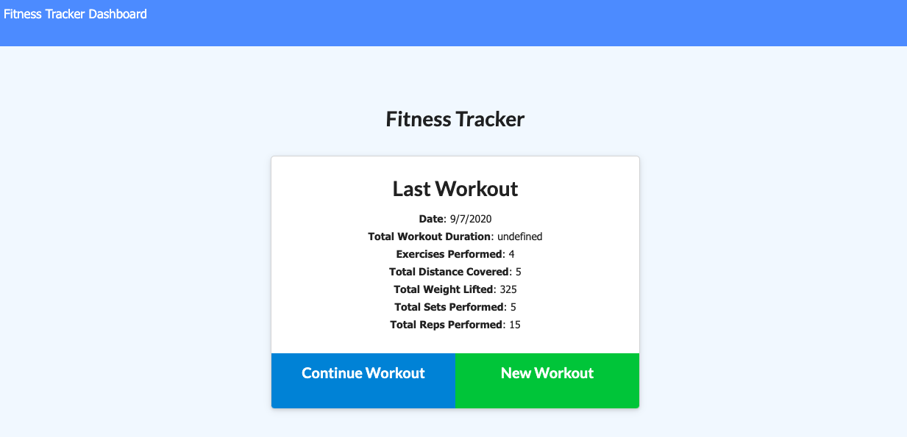
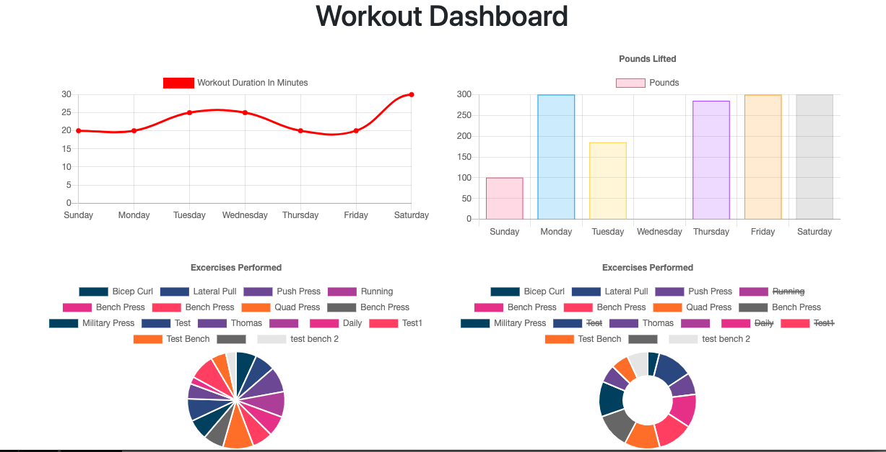
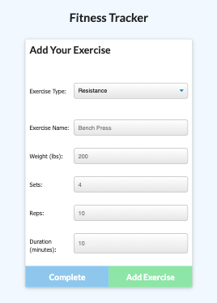

# 17-Workout-Tracker

##  Repository: 
[Github Workout Tracker](https://github.com/TBragg800/17-Workout-Tracker)

##  Deployed Site:
[Heroku Deployed Workout Tracker](https://fathomless-falls-53930.herokuapp.com/)

## Walkthrough Video Demonstration: 
# 

* YouTube link to the 
[walkthrough](https://youtu.be/iC-ADLtSXD4)

## Table of Contents
  [Description](#Description)

  [Installation](#Installation)

  [Usage](#Usage)

  [License](#License)

  [Contributing](#Contributing)

  [Tests](#Tests)

  [Questions](#Questions)
  
## Description
This application is a workout tracker for users who want to be able to view create and track daily workouts, log multiple exercises in a workout on a given day, be able to track the name, type, weight, sets, reps, and duration of exercise. If the exercise is a cardio exercise, the user is able to track the distance traveled. This application was created in node using Express for route handling, a MongoDB Database and a Mongoose ODM for data mangement.  

## Installation

## Usage - Local
* Begin by cloning the repo locally.
* Using the CLI, the user should navigate to the project directory and run 'npm install'.
* Use MongoDB for database handling.
* For non-local usage see heroku deployed site link above.

## License
  MIT License

Copyright (c) 2020 Thomas Bragg

Permission is hereby granted, free of charge, to any person obtaining a copy
of this software and associated documentation files (the "Software"), to deal
in the Software without restriction, including without limitation the rights
to use, copy, modify, merge, publish, distribute, sublicense, and/or sell
copies of the Software, and to permit persons to whom the Software is
furnished to do so, subject to the following conditions:

The above copyright notice and this permission notice shall be included in all
copies or substantial portions of the Software.

THE SOFTWARE IS PROVIDED "AS IS", WITHOUT WARRANTY OF ANY KIND, EXPRESS OR
IMPLIED, INCLUDING BUT NOT LIMITED TO THE WARRANTIES OF MERCHANTABILITY,
FITNESS FOR A PARTICULAR PURPOSE AND NONINFRINGEMENT. IN NO EVENT SHALL THE
AUTHORS OR COPYRIGHT HOLDERS BE LIABLE FOR ANY CLAIM, DAMAGES OR OTHER
LIABILITY, WHETHER IN AN ACTION OF CONTRACT, TORT OR OTHERWISE, ARISING FROM,
OUT OF OR IN CONNECTION WITH THE SOFTWARE OR THE USE OR OTHER DEALINGS IN THE
SOFTWARE.

## Contributing
  Fork the project & clone locally. Create an upstream remote and sync your local copy before you branch. Branch for each separate piece of work. Do the work, write good commit messages, and read the CONTRIBUTING file if there is one. Push to your origin repository. Create a new PR in GitHub.

## Tests
  There are no current tests for this applications.

## Questions
  All questions should be submitted to the email listed below. Please consult the GitHub profile or Repo for additional concerns. 
  Email: Ttbbragg83@gmail.com
  Github: [TBragg800](http://github.com/TBragg800)

## Screenshot of deployed application
# 

